# Apresentação · Tech Challenge Fase 1

> **Oficina Mecânica Backend** · Pós Tech Software Architecture · FIAP

---

## Sumário

**1ª Seção — Motivação e modelagem de domínio**
1. [Objetivo](#1-objetivo)
2. [Domain Storytelling](#2-domain-storytelling)
3. [Linguagem Ubíqua](#3-linguagem-ubíqua)
4. [Event Storming](#4-event-storming)

**2ª Seção — Desenvolvimento do backend**

5. [API · arquitetura monolítica em camadas](#5-api--arquitetura-monolítica-em-camadas)

**3ª Seção — Qualidade e segurança**

6. [Segurança](#6-segurança)
7. [Qualidade](#7-qualidade)

**4ª Seção — Validação e execução**

8. [Como rodar localmente](#8-como-rodar-localmente)
9. [Evidências e documentação](#9-evidências-e-documentação)

---

# 1ª Seção — Motivação e modelagem de domínio

## 1. Objetivo

**Desafio.** Oficina de médio porte controla atendimento em **planilhas, papel e WhatsApp** — sem rastreabilidade, sem controle de estoque, sem histórico financeiro.

**Proposta.** MVP do back-end focado em **OS, clientes e peças**, com **DDD**, qualidade e segurança.

---

## 2. Domain Storytelling

Captura do negócio em **narrativas curtas, na linguagem do usuário**, antes da modelagem técnica.

### 2.1. Fluxo principal

```mermaid
flowchart LR
    A1["1 · Cadastra<br/>peças/serviços"]:::func --> A2
    A2["2 · Abre OS"]:::func --> B1
    B1["3 · Diagnóstico<br/>+ orçamento"]:::tec --> C1
    C1["4 · Aprova<br/>orçamento"]:::cli --> B2
    B2["5 · Executa reparo<br/>+ finaliza"]:::tec --> C2
    C2["6 · Paga e<br/>informa"]:::cli --> A3
    A3["7 · Valida<br/>pagamento"]:::func --> B3
    B3["8 · Entrega<br/>o veículo"]:::tec

    classDef func fill:#dbeafe,stroke:#2563eb,stroke-width:2px,color:#1e3a8a
    classDef tec  fill:#dcfce7,stroke:#16a34a,stroke-width:2px,color:#14532d
    classDef cli  fill:#fef3c7,stroke:#d97706,stroke-width:2px,color:#78350f
```



**Legenda:** 🔵 Funcionário · 🟢 Técnico · 🟡 Cliente

1. **Funcionário** cadastra serviços/peças e mantém o estoque
2. **Funcionário** abre a Ordem de Serviço
3. **Técnico** diagnostica, orça e envia para aprovação
4. **Cliente** aprova o orçamento
5. **Técnico** executa o reparo e finaliza
6. **Cliente** paga e informa a oficina
7. **Funcionário** valida o pagamento
8. **Técnico** entrega o veículo

### 2.2. Jornadas modeladas (Egon.io)

| # | Jornada | Diagrama |
|---|---|---|
| 01 | Principal — Atendimento da OS | [🖼️ PNG](docs/01-ddd/01-1-stortelling/Stortelling-01-Jornada-Principal-Atendimento-OS.png) |
| 02 | Exceção — Falta de peças | [🖼️ PNG](docs/01-ddd/01-1-stortelling/Stortelling-02-Jornada-Excecao-por-Falta-de-Pecas.png) |
| 03 | Exceção — Refazer orçamento | [🖼️ PNG](docs/01-ddd/01-1-stortelling/Stortelling-03-Jornada-Excecao-Reprovacao-de-Orcamento-para-ser-Refeito.png) |
| 04 | Exceção — Cancelar OS | [🖼️ PNG](docs/01-ddd/01-1-stortelling/Stortelling-04-Jornada-Excecao-Reprovacao-de-Orcamento-para-Cancelar-OS.png) |

> Arquivos `.egn` editáveis em [`docs/01-ddd/01-1-stortelling/egn/`](docs/01-ddd/01-1-stortelling/egn/) — abrir em [egon.io/app](https://egon.io/app/).

---

## 3. Linguagem Ubíqua

- Mesmo termo na **conversa, no código, na API e nos logs**
- Organizado por **bounded context** (principal, genéricos, suporte)
- **Termos polissêmicos** sempre qualificados: Cliente, Cancelar, Pagamento
- Comandos do negócio: *"o cliente aprovou"* → `aprovarOrcamento`

📎 [Glossário (.docx)](docs/01-ddd/01-3-linguagem_ubiquoa_oficina_mecanica.docx)
📎 [Bounded Contexts (PNG)](docs/01-ddd/boudand-context-oficina-mecanica.png)
---

## 4. Event Storming

Descoberta colaborativa no Miro — **eventos, comandos, agregados e políticas** **antes do código**.

| Categoria | Exemplos |
|---|---|
| **Eventos** | `OsAberta` · `OrcamentoAprovado` · `ReparoConcluido` · `OsPaga` · `OsEntregue` · `NfEmitida` |
| **Comandos** | `abrirOs` · `aprovarOrcamento` · `concluirReparo` · `confirmarPagamento` · `entregar` |
| **Políticas** | Pagamento → Conta a Receber · NF → credita estoque · **Estoque nunca negativo** |

📎[Event Storming (JPG)](docs/01-ddd/01-2-eventstorming/01-2-eventstorming.jpg) · [Quadro Miro](https://miro.com/welcomeonboard/SUFWT0NLUGt4MHgxZ01qN2J5UHdoeDNYbmNaZTZEVjRYUUZ5TWNTMjRUV2JNajVhcGxDZUliek8yMEFRbEEwQWNpaWhnL2M2dUJaNEhvaDhXWCszRmw2ZHRnSEkydHJHNVZJUEZFYU5NQ21qT0xlYm93eTNKaENrSi9CQU9wZWR0R2lncW1vRmFBVnlLcVJzTmdFdlNRPT0hdjE=?share_link_id=775209260846)

---

# 2ª Seção — Desenvolvimento do backend

## 5. API · arquitetura monolítica em camadas

### 5.1. Controllers

| Controller | Responsabilidade | Acesso |
|---|---|---|
| **AuthController** | Login + JWT | Público |
| **AdministrativoOficinaController** | Cadastros · NF · OS · financeiro · relatórios | `FUNCIONARIO_DA_OFICINA` |
| **TecnicoOficinaController** | Diagnóstico · orçamento · execução · finalização | `TECNICO_DA_OFICINA` |
| **ClienteOficinaController** | Consulta pública do status da OS | Público |

> `FUNCIONARIO_DA_OFICINA` **herda** `TECNICO_DA_OFICINA` (hierarquia no `SecurityConfig`).

### 5.2. Stack

| Camada | Tecnologia |
|---|---|
| Linguagem · Framework · Banco | **Java 21 LTS · Spring Boot 3.3 · PostgreSQL 16** |
| Persistência | Spring Data JPA · Hibernate 6 · Flyway |
| Segurança | Spring Security 6 · jjwt · BCrypt |
| Doc/Observabilidade | springdoc-openapi · Spring Actuator · Logback JSON |
| Testes/Cobertura/Análise | JUnit 5 · Testcontainers · RestAssured · ArchUnit · JaCoCo · SonarQube |

📎 [Catálogo de endpoints](docs/03-api/API.md) · Swagger: `http://localhost:8080/swagger-ui.html`

---

# 3ª Seção — Qualidade e segurança

## 6. Segurança

### 6.1. Perfil com autenticação JWT

- **Spring Security 6 + jjwt** (HMAC-SHA256), segredo ≥ 256 bits validado no boot
- `@PreAuthorize` + **hierarquia** `FUNCIONARIO_DA_OFICINA` > `TECNICO_DA_OFICINA`
- **BCrypt cost 12** · validade JWT configurável por env (`JWT_EXPIRATION_MINUTES`) ou por requisição (`validadeMinutos`, 1–1440)
- CORS restrito · erros padronizados sem stack trace · códigos estáveis (`USR-001`, `OS-014`)

### 6.2. Perfil sem autenticação (canal público)

- `GET /consulta/ordens-servico/{numeroOs}/status` — **só consulta** (read-only)
- Outros endpoints livres: `/auth/login` · `/actuator/health` · `/swagger-ui/**` · `/v3/api-docs/**`

📎 [Security Report](docs/04-security/security-report.md) · [OWASP Top 10](docs/04-security/owasp-top10.md) · [`SecurityConfig.java`](src/main/java/br/com/oficina/config/SecurityConfig.java)

---

## 7. Qualidade

**Três frentes complementares**, todas no pipeline CI a cada PR:

| Frente | Ferramentas | Gate |
|---|---|---|
| **Testes** | JUnit 5 · AssertJ · Mockito · Testcontainers · RestAssured · **ArchUnit** | Cobertura ≥ 80% em `domain.model` (JaCoCo) |
| **SAST** | SonarQube Community Edition | Quality gate verde |
| **SCA** | SBOM CycloneDX + **Dependency-Track** · Trivy · OWASP Dep-Check (profile) | Build falha em **CVSS ≥ 9** |

> **DAST** está fora do escopo da Fase 1 — mapeado para Fase 2 (OWASP ZAP em staging).

📎 [Validation Report](docs/05-evidencias/VALIDATION_REPORT.md) · [Dependency-Track guide](docs/04-security/dependency-track-readme.md) · [Bootstrap Dep-Track em PC novo](docs/04-security/dependency-track-do-primeira-utilizacao.md) · [CI workflow](.github/workflows/ci.yml)

---

# 4ª Seção — Validação e execução

## 8. Como rodar localmente

**Pré-requisito:** Docker Desktop com ≥ 6 GB RAM alocados.

### 8.1. Subir os containers

```bash
docker compose up --build -d
```

> Aguarde ~30s para inicialização completa.

### 8.2. Acessar

| Recurso | URL | Credenciais |
|---|---|---|
| API | http://localhost:8080 | — |
| Swagger UI | http://localhost:8080/swagger-ui.html | — |
| Adminer | http://localhost:8081 | server `db` · user/senha/db: `oficina` |
| Health | http://localhost:8080/actuator/health | — |

### 8.3. Login

`POST /auth/login` com **`admin@oficina.local` / `admin123`** → retorna JWT.
Usar em `Authorization: Bearer <token>` para endpoints protegidos.

### 8.4. Variáveis opcionais (sobrescrever admin)

**Bash/Linux/Mac:**
```bash
export ADMIN_EMAIL="seu-admin@empresa.com"
export ADMIN_PASSWORD="sua-senha-forte"
docker compose up --build -d
```

**PowerShell/Windows:**
```powershell
$env:ADMIN_EMAIL = "seu-admin@empresa.com"
$env:ADMIN_PASSWORD = "sua-senha-forte"
docker compose up --build -d
```

📎 [README completo](README.md) · [docker-compose.yml](docker-compose.yml) · [Acesso ao banco](docs/02-adr/DATABASE_ACCESS.md)

---

## 9. Evidências e documentação

| Tipo | Arquivos em [`docs/05-evidencias/`](docs/05-evidencias/) |
|---|---|
| **SonarQube** | 2 PDFs (análises 01–02) |
| **Swagger UI** | 2 PDFs (capturas dos endpoints) |
| **PostgreSQL** | 1 PDF (modelo relacional das tabelas) |
| **SCA · Dependency-Track** | 7 PDFs (análises 00–06 — evolução das vulnerabilidades) |
| **Relatório final** | [`VALIDATION_REPORT.md`](docs/05-evidencias/VALIDATION_REPORT.md) |

📎 [Índice geral da documentação](docs/README-DOCS.md)
