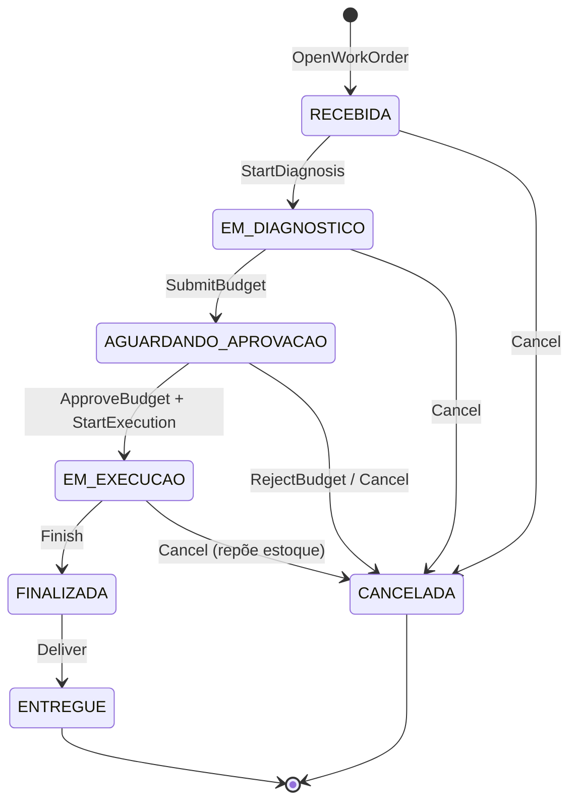

# Máquina de Estados – Ordem de Serviço

## Tabela de transições

| De | Comando | Para | Condição | Efeito colateral |
|---|---|---|---|---|
| — | `OpenWorkOrder` | RECEBIDA | cliente e veículo existem | gera `trackingToken`; emite `WorkOrderCreated` |
| RECEBIDA | `StartDiagnosis` | EM_DIAGNOSTICO | role MECANICO | emite `DiagnosisStarted` |
| RECEBIDA, EM_DIAGNOSTICO | `AddServiceItem` | (mesmo estado) | serviço ativo | congela preço; emite `WorkOrderItemAdded` |
| RECEBIDA, EM_DIAGNOSTICO | `AddPartItem` | (mesmo estado) | peça ativa e `stock >= qty` | congela preço; emite `WorkOrderItemAdded` |
| EM_DIAGNOSTICO | `SubmitBudget` | AGUARDANDO_APROVACAO | `items.length > 0` | trava itens; emite `BudgetSubmitted` |
| AGUARDANDO_APROVACAO | `ApproveBudget` | (mesmo estado) | `trackingToken` válido | registra aprovação; emite `BudgetApproved` |
| AGUARDANDO_APROVACAO | `RejectBudget` | CANCELADA | `trackingToken` válido | emite `BudgetRejected` + `WorkOrderCancelled` |
| AGUARDANDO_APROVACAO | `StartExecution` | EM_EXECUCAO | `approval.approved == true`, role MECANICO | consome estoque; emite `ExecutionStarted` + `StockConsumed` |
| EM_EXECUCAO | `FinishWorkOrder` | FINALIZADA | role MECANICO | emite `WorkOrderFinished` (com duração) |
| FINALIZADA | `DeliverWorkOrder` | ENTREGUE | role ATENDENTE | emite `WorkOrderDelivered`; invalida token |
| qualquer não-terminal | `CancelWorkOrder` | CANCELADA | role ADMIN | se peças consumidas, repõe estoque; emite `WorkOrderCancelled` |

Qualquer outra combinação retorna `WO_INVALID_STATUS_TRANSITION` (HTTP 409).
